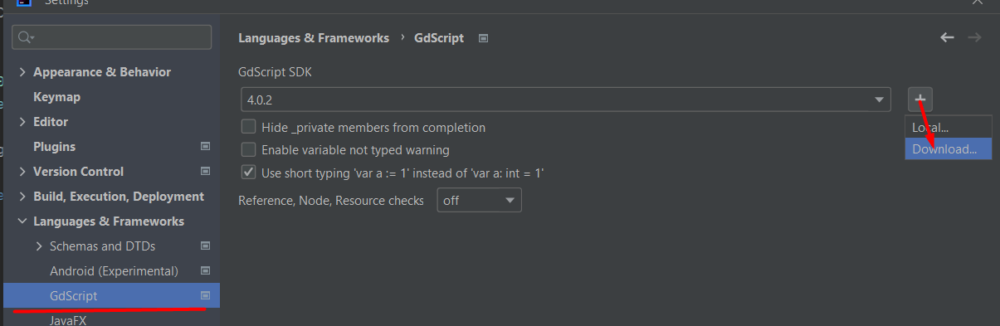

# GdScript


!!!!!!!!!!!!!
IMPORTANT
!!!!!!!!!!!!!
Currently  his plugin is broken and not working properly... please wait for release of 1.1.0 version where most of it should be fixed.
To get notification you can subscribe/comment to receive updates when this [blocker]//gitlab.com/IceExplosive/gdscript/-/issues/117) is closed.

Language plugin for JetBrains IDEs (Intellij, Rider and all the other ones) of GdScript2  
https://plugins.jetbrains.com/plugin/20123-gdscript

# Installation

Please follow installation instructions

1. Download the plugin from Marketplace
   - There are currently 2 plugins, use the one from "IceExplosive"
2. Restart the IDE, due to unknown reasons, some parts like Highlighting is not working right after installation
3. Download an SDK from Language settings (since v1.1.0)
   

## Plugin settings:
- In order to dedent on backspace instead of deleting a line, you can change editor's settings under:  
Editor -> General -> Smart Keys -> UnIndent on Backspace
- By default, few of annotators are off due dynamics of Godot and GdScript, you can change it in settings, but then
it's required to be thorough when specifying types
- Warning that variable is not typed is disabled by default, but I recommend to opt-in (types can be added via alt+enter)  
- Completion settings: Editor -> General -> Code Completion -> Parameter Info
  - Try turning on: `Show parameter name hints on completion` which invokes hints after auto-completion

## Known large issues:
- lambda following by in if statement breaks the parser [#issue](https://gitlab.com/IceExplosive/gdscript/-/issues/117)
```
var labmda = func(x): print(x)
if true:
  print(x)
```
breaks the code atm is it parses into Ternary expression... workaround is to put `pass` in between
```
var labmda = func(x): print(x)
pass
if true:
  print(x)
```
- IDE must be opened from Godot's root folder, otherwise resource paths are incorrect [#issue](https://gitlab.com/IceExplosive/gdscript/-/issues/97)

## Known limitations

- get_node(), get_parent() and so on atm do not parse actual Node, but only as a generic Node type (will be supported later on)
- get_window() (and maybe few other methods) return different class based on context (SubViewport, Window, ...),
plugin specify it as base Viewport class, so to get completion/check for inherited ones available you have to manually specify the type
- Dynamic nodes and such added at runtime cannot be predicted and thus no autocompletion

## List of features

Video preview (version 0.7): https://youtu.be/hjtzJW25GMI  
[Screenshots](./documentation/features.md)  

- Auto-completion
  - Inheritance & ClassName
  - Annotations
  - func overrides
  - Resources (`$Path/Node` && `$"%Name"`)
  - Inputs, Groups, Meta fields, user resources
- Refactoring
- Go to declaration / usages
- File templates taken from Godot's source
- Hides _prefix as private fields (optional based on Language settings)
- Built-in [documentation](./documentation/auto-documentation.md) (Ctrl+Q)
- Line markers
  - Resource usages  
  - Signals  
  - Super method
  - Color picker
  - Run current scene
- Inlay hints  
- Param hints (Ctrl+P)  
- Run configuration - start game from Editor
- Formatter
- is/has conditioned type for validations (ignore checks following get_node)

## Actions
### Quick fixes
- Add/change return Type
- Generate get_set methods
- Remove annotation
- Change class_name to match filename
- Remove getter & setter
- Too many arguments / change function type

#### Trait like system
Experimental hacky work-around to fill [Trait like feature](./documentation/trait.md) (since v1.1.1)
