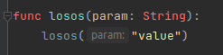
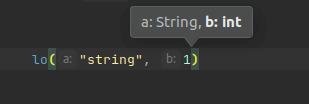
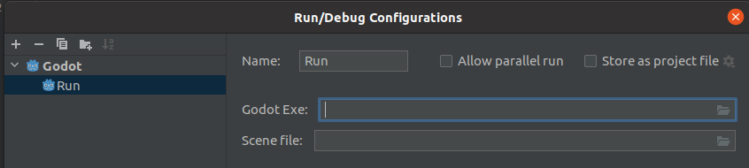

# GdScript

## Work queue
### Top priority (Alpha)
- Lambdas
- Inner class
- Sdk

### Middle Priority (Betta)
- master/puppet keywords
- Annotation parameters - checks and hints
- Full feature Formatter
- Signals
  - parameter hint
  - parameter check
- Check Parameters in function call
- Await
  - check if it is correctly implemented
  - check if awaiting an async task
  - check if async task is awaited
- expr type match
- Resource exists
- Double enter -> force dedent
- Create getter/setter via Alt+Insert
- Run configuration
  - remove pop-up to make it single click
  - tady může být více scriptů (potřeba ověřit ID)
- Don't auto-complete private functions/fields (leading underscore) -> allow it based on settings
- Line marker (signals, ...)
- Enum checks
- Flow templates
- Icon download with class refresh

### Low Priority (Full Release)
- Parent method call fe.: ._init() checks
- Rename file -> rename also class_name
- Linkable Documentation
- type of var binding in match pattern
- solo string expects endStmt
- Debug - does it Godot even allow? ...

## List of features
### Auto-completion
- Inheritance & ClassName
- Annotations
- func overrides
- Resources (`$Path/Node` && `$"%Name"`)

### Documentation (Ctrl+Q)
- Currently only simplified plain-text
- ❌ Links and visualization like Java doc

### Other
- Inlay hints  
 
- Param hints (Ctrl+P)  

- Run configuration - starts the game from Godot exe  

### Formatter
- Very simplified version - requires major work  
- ❌ Optional semicolons (add/remove based on settings)

## Actions
### Quick fixes
#### Alt+Enter
- add/change return Type
- remove annotation
- change class_name to match filename
