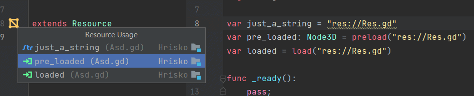

# GdScript

# Installation guide
1) Download GdScript plugin from marketplace (from IceExplosive)  
  
2) Download SDK zip from this repository and extract it somewhere (current version 0.x matches Godot's beta x)  
3) GoTo File -> Project Structure settings  
4) Select SDK tabs and create new GdScript SDK  
  
5) Select extracted folder  
   - *Ignore the error about cannot read SDK version*  
  
6) Add again the same folder as a Classpath  
  
7) Under Project tab select created GdScript SDK  


## Extra tips:
- Dedent with Backspace
```
func losos():
    if (true):
        pass
        |
```
When you hit Backspace at cursor (below pass), IDEa will remove whole line and move you to
previous line, like this:
```
func losos():
    if (true):
        pass|
```
In order to dedent on backspace, you can change editor's settings under:  
Editor -> General -> Smart Keys -> Unindent on Backspace  
  
Hitting Backspace will then just move cursor to the left like this:
```
func losos():
    if (true):
        pass
    |
```

## List of features
### Auto-completion
- Inheritance & ClassName
- Annotations
- func overrides
- Resources (`$Path/Node` && `$"%Name"`)
- hides _prefix as private fields (is optional based on Language settings)

### Line markers
- Resource usages  

- Signal  


### Documentation (Ctrl+Q)
- Currently only simplified plain-text
- ❌ Links and visualization like Java doc

### Other
- Inlay hints  

- Param hints (Ctrl+P)  

- Run configuration - starts the game from Godot exe  


### Formatter
- Very simplified version - requires major work  
- ❌ Optional semicolons (add/remove based on settings)

## Actions
### Quick fixes
#### Alt+Enter
- add/change return Type
- generate get_set methods
- remove annotation
- change class_name to match filename
- remove getter & setter
