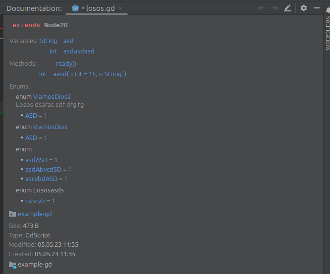
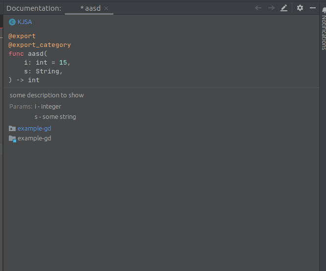
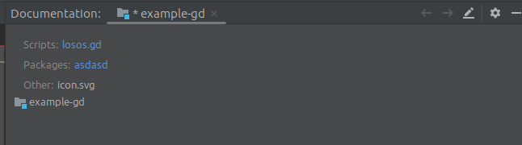

# Auto documentation feature (Ctrl+Q)

Documentation is available for range of element like variable, constants, methods, classes and even packages/folders.  
Many of them also support variety of custom documentation via comment lines above it with specific marker.

## Available markers
- #desc - standard description included in almost all elements
- #brief - short description for remote element should you hover above it
- #param - (method) for extra parameter description
  - #param [param_name] description
- #return - (method) extra description for return value
- #tutorial - (class) used for tutorial links available from Godot source
- #enum - (enum) name in case of unnamed enums

Many examples can be found within built-in classes

## Examples

### Auto-completion
#### nameless Class

#### Method

#### Folder

