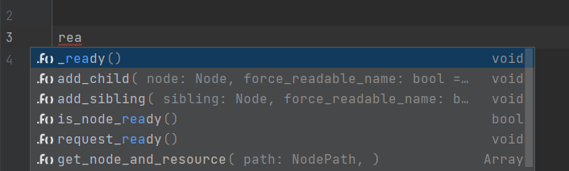

# Features

### Auto-completion  

##### Inheritance & ClassName
  
##### Annotations

##### func overrides

##### Resources (`$Path/Node` && `$"%Name"`)

[//]: # (    - Inputs, Groups, Meta fields, user resources)

### Refactoring

### Go to declaration / usages

### File templates taken from Godot's source

### Hides _prefix as private fields (optional based on Language settings)

### Built-in documentation (Ctrl+Q)

### Line markers
[//]: # (    - Resource usages)
[//]: # (    - Signals)
##### Super method

##### Color picker

##### Run current scene

### Inlay hints

### Param hints (Ctrl+P)

### Run configuration - start game from Editor

### Formatter

### is/has conditioned type for validations (ignore checks following get_node)

# Actions
### Quick fixes
##### Add/change return Type

##### Generate get_set methods

##### Remove annotation

##### Change class_name to match filename

##### Remove getter & setter

##### Too many arguments / change function type
  
