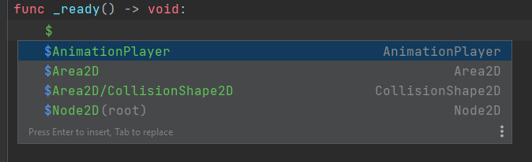

# Features

### Auto-completion  

### Inheritance & ClassName
  
### Annotations

### func overrides

### Resources (`$Path/Node` && `$"%Name"`)

[//]: # (    - Inputs, Groups, Meta fields, user resources)
[//]: # (- Refactoring)
[//]: # (- Go to declaration / usages)
[//]: # (- File templates taken from Godot's source)
[//]: # (- Hides _prefix as private fields &#40;optional based on Language settings&#41;)
[//]: # (- Built-in documentation &#40;Ctrl+Q&#41;)
# Line markers
[//]: # (    - Resource usages)
[//]: # (    - Signals)
### Super method

### Color picker

### Run current scene

[//]: # (- Inlay hints)
[//]: # (- Param hints &#40;Ctrl+P&#41;)
[//]: # (- Run configuration - start game from Editor)
[//]: # (- Formatter)
[//]: # (- IS conditioned type for validations &#40;ignore checks following get_node&#41;)

[//]: # (## Actions)

[//]: # (### Quick fixes)

[//]: # (#### Alt+Enter)

[//]: # (- add/change return Type)

[//]: # (- generate get_set methods)

[//]: # (- remove annotation)

[//]: # (- change class_name to match filename)

[//]: # (- remove getter & setter)

[//]: # (- too many arguments / change function type)