## Features

List of implemented features  
Please report any issues you encounter - this is still yet to be battle tested

### Auto-completion

    
Standard completions of Variables, Constants, Methods, Signals, Enums, Classes, Annotations, ...

    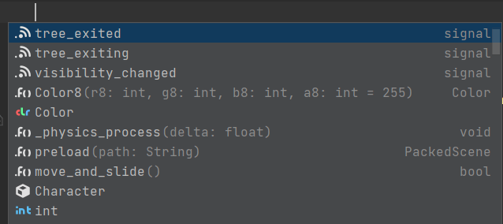

    
Methods directly insert whole method

    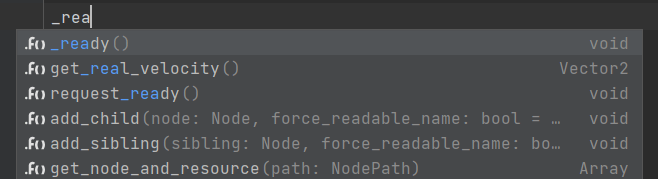  
    
&nbsp;

    <strong>Resulting in:</strong>  
    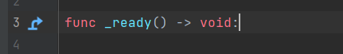

    
Nodes

    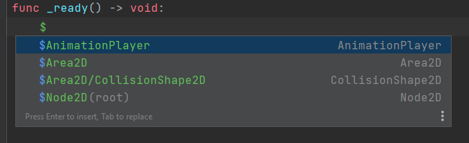

    
Inputs, Groups, Meta fields, Resources

    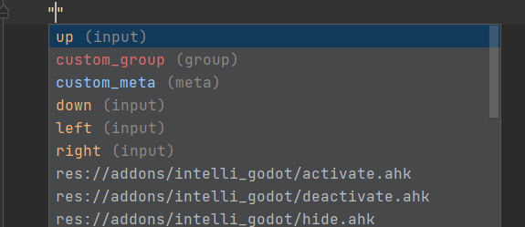

### Usages

    
Go to declaration / usages

    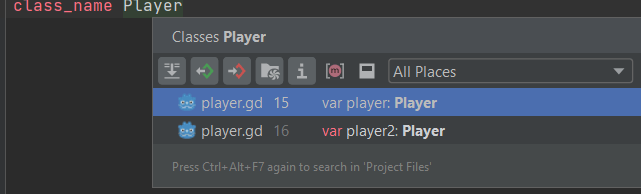

    
Refactoring

    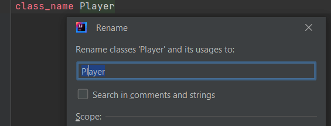

    
Go to file resource (Ctrl+Click)

    <strong>Currently not working as required API is not allowed publicly yet</strong>
    
<a href="https://gitlab.com/IceExplosive/gdscript/-/issues/165">Issue</a>

    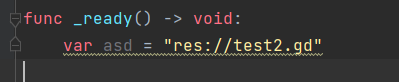

### File templates

    
Predefined from Godot's source

    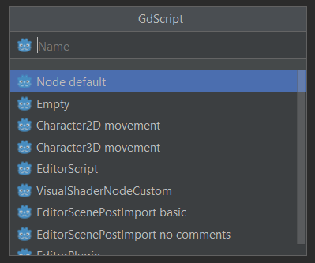

    
Custom templates

    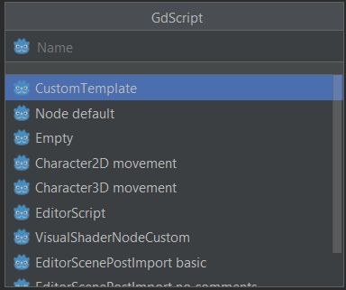

### Hide private fields

    
Hides _underscore prefixed variables and methods from completions

    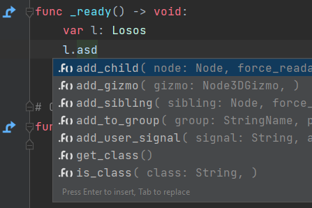
    
&nbsp;

    <strong>While showing them within the class itself</strong> 
    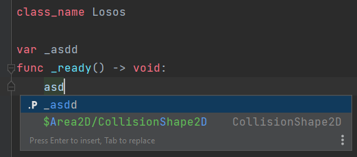

    
Setting for turning it it off

    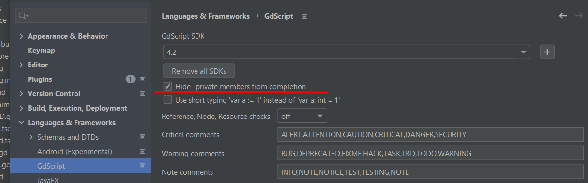

### Built-in documentation (Ctrl+Q)

    
Generated documentation from comments

    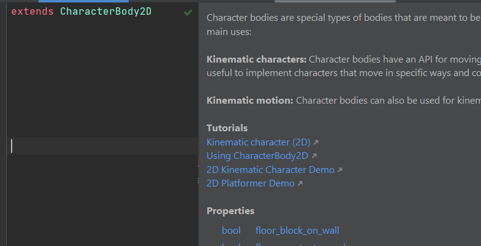

### Line markers

    
Parent(super) methods

    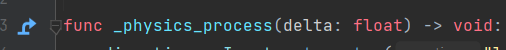
    
On click redirects to given method

    
Run current scene

    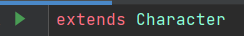

    
Resource usages

    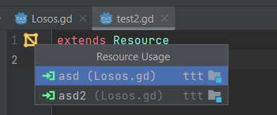

    
Connected signals

    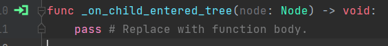

    
Inherited scene

    

    
Color picker

    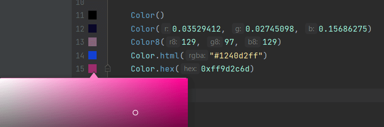

### Parameter hints

    
Param hints (Ctrl+P)

    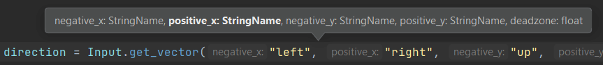

    
Inlay hints

    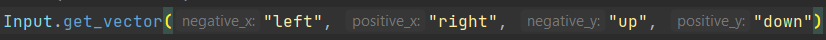

### Run configuration - start game from Editor

    
Add Godot's path

    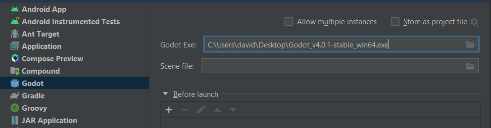

### Formatter

    
Code formatter

    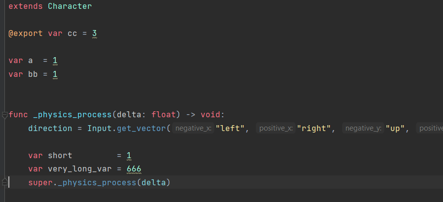

    
Code style settings

    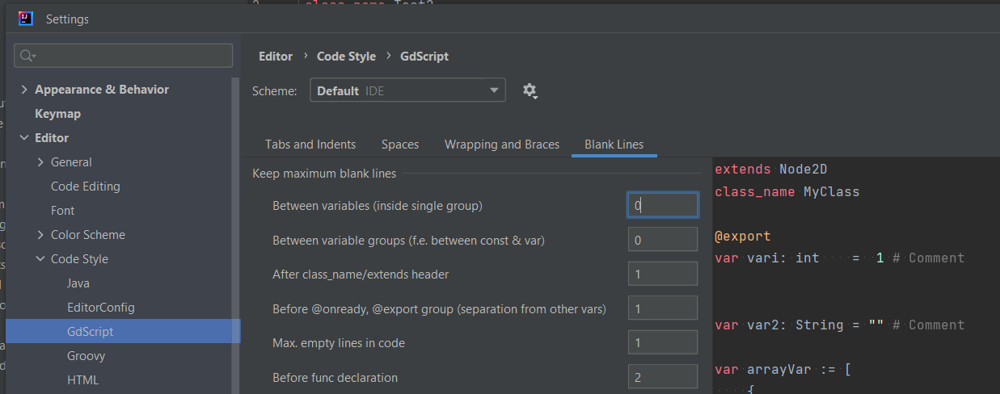

### Validations

#### Type checks

    
is/has conditioned type

    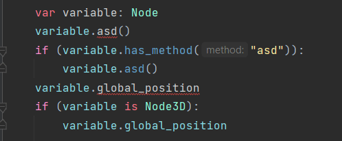

    
is/has correct return

    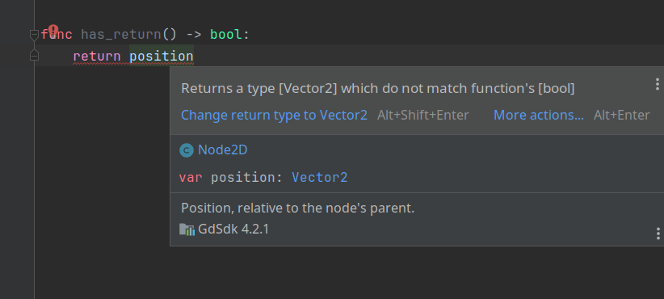

#### Method correctness

    
unreachable code

    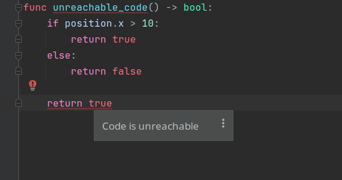

    
all paths return

    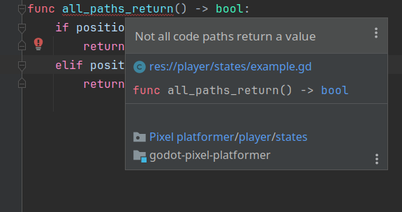

### Actions

    
Add/change return Type

    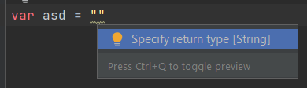

    
Generate get_set methods

    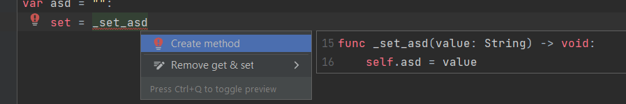

    
Remove annotation

    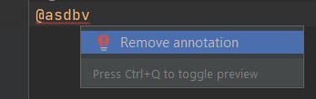

    
Change class_name to match filename

    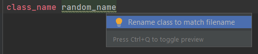

    
Remove getter & setter

    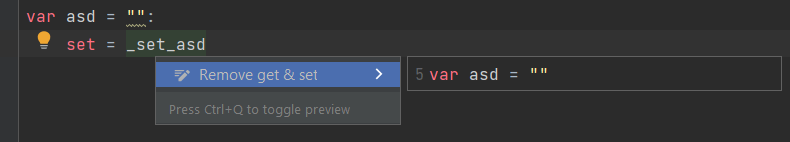

    
Too many arguments

    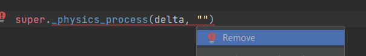

    
Change function type

    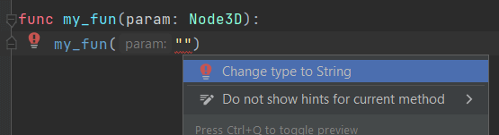

### ["Trait" like feature](trait.md)

### Known limitations

    
get_node, get_parent

    

        <strong>get_node</strong>, <strong>get_parent</strong> and so on atm do not parse actual Node, but only as a generic Node type (will be supported later on)
    

    
get_window method

    

        <strong>get_window</strong> (and maybe few other methods) return different class based on context (SubViewport, Window, ...)
         
        Plugin specify it as base Viewport class, so to get completion/check for inherited ones available you have to manually specify the type
    

    
Dynamic nodes

    

        Dynamic nodes and such added at runtime cannot be predicted and thus no autocompletion is available
    

