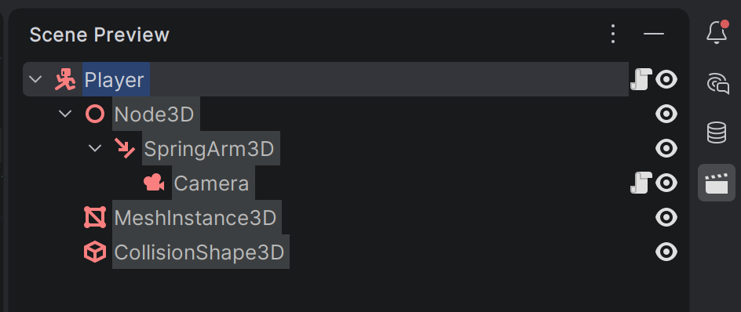
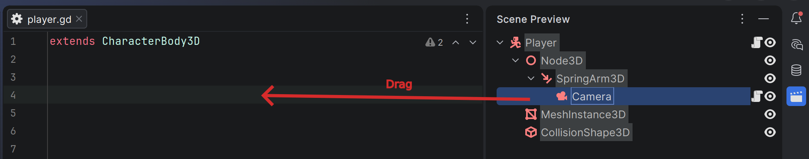
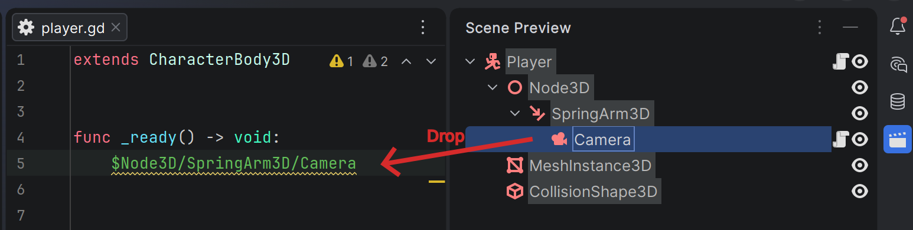
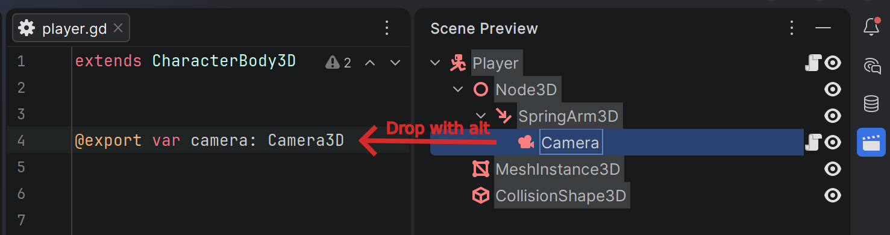
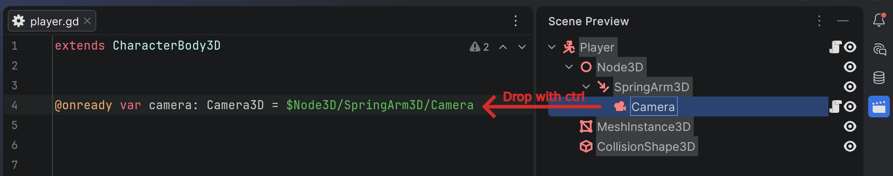
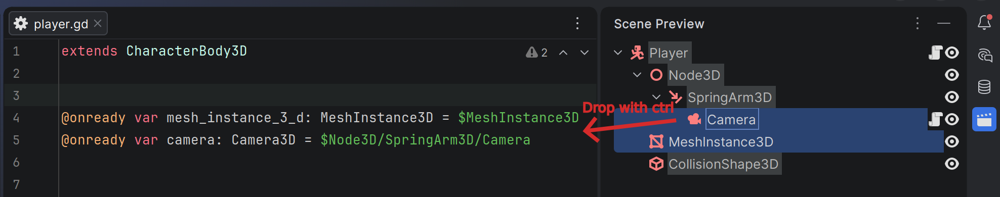

## Scene preview details

Scene preview shows the tree of nodes. It is either the opened `.tscn` file. Or the scenes, assosiated with the opened script (`.gd` or `.cs`).

You can also drag nodes from the preview into the editor. A plain drag inserts a relative path from the current script to the dropped node. Ctrl-drag inserts an `@onready` snippet, and Alt-drag inserts an `@export` snippet.

Multiple nodes can be dragged at once.
