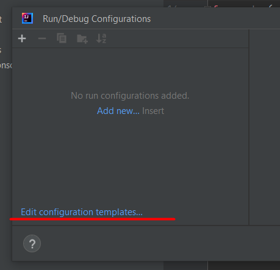
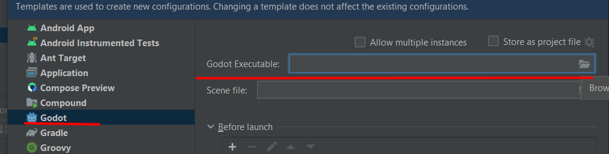

# Installation 

1. Download the plugin from Marketplace
    - There are currently 2 plugins, use the one from "IceExplosive"
2. Restart the IDE, due to unknown reasons, some parts like Highlighting is not working right after installation
    - P.S. If you have version under 2.1.0, please first uninstall it, then do a fresh install. There is some sdk issue I haven't figured out.
3. Setting up run configuration
    - 

          
Open run configuration templates

          
      

    - 

          
Under Godot add path to executable

          
      

   
## Plugin settings:
- In order to dedent on backspace instead of deleting a line, you can change editor's settings under:

IntelliJ: Editor -> General -> Smart Keys -> Unindent on Backspace  
Rider: Editor -> General -> Typing Assistance -> Unindent on Backspace  
... or just search for "Unindent"

- By default, few of annotators are off due dynamics of Godot and GdScript, you can change it in settings, but then
  it's required to be thorough when specifying types
- Warning that variable is not typed is disabled by default, but I recommend to opt-in (types can be added via alt+enter)
- Completion settings: Editor -> General -> Code Completion -> Parameter Info
    - Try turning on: `Show parameter name hints on completion` which invokes hints after auto-completion
