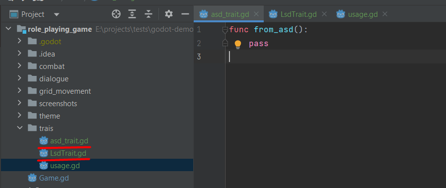
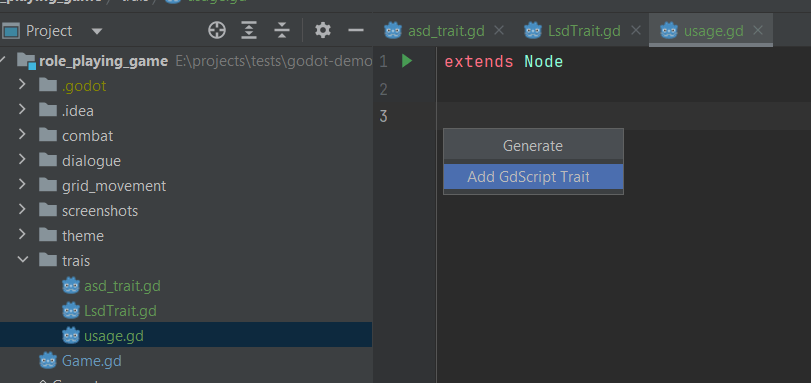
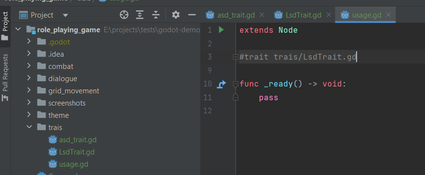
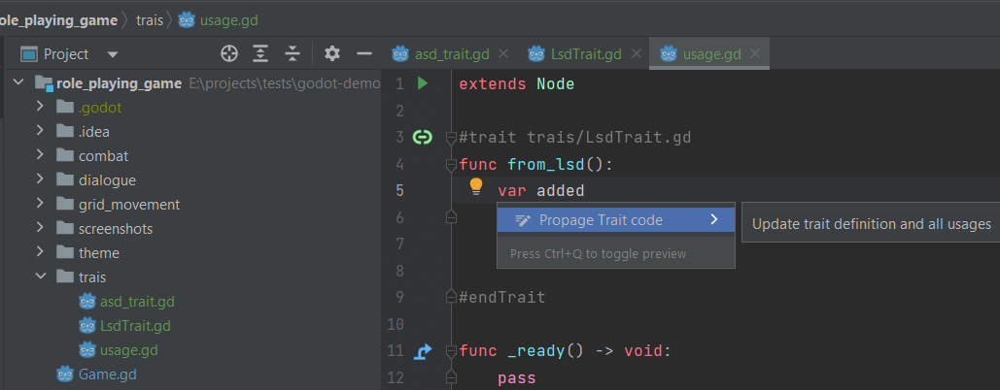

# Trait/Mixin like helper (since v1.1.1)

Traits or Mixins are pieces of code that you can attach to any other code and have both 
available it at different places & defined in a single spot without needing to share common parent class.

As Godot does not offer any such feature there is a very hacky workaround built into this plugin.

### TLDR:
- create "xxx_trait.gd" file and insert code
- Alt+Insert to insert Trait into Scripts
- Alt+Enter to propagate changes to all usages & Trait file

### Whole explanation:

First you have to define Trait files - their names must end with "trait" word (caseinsensitive)  

Define what ever code you want inside. Then to apply it into any of your scripts, use Alt+Insert shortcut
to pop Insertion modal and select and of defined files.  
  
  

Editor will then copy-paste contained code which is enclosed in two comments starting with #trait [pathToClass]
and ending with #endTrait comment  
  

DO NOT EDIT THOSE COMMENTS  
they mark trait usages for following feature.

To cheat around "single spot of definition" plugin offers "Propagate" action which copy-paste the code again into all
spots where the Trait is used and it's definition.
  

Propagation is available in the Trait file or anywhere between #trait #endTrait comments  
After expanding Trait comment you'll see a green mark when Trait file is found or a red one, when not.

To help with auto-completions traits can also include "extends xxx" line which is not propagated into usages.  

This is an experimental work-around and hopefully GdScript will get proper support for Traits.  
If you have any ideas, please let me know via GitLab issues f.e.
