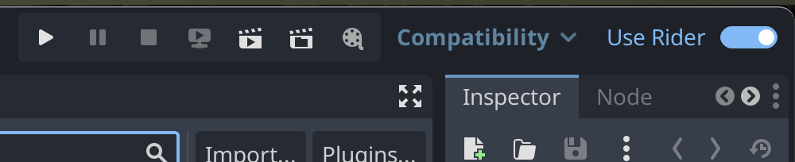

# JetBrains Rider External Editor – Godot Plugin

A Godot Editor plugin that adds a "Use Rider" toggle to the Godot toolbar and, when enabled, applies a set of editor settings recommended for working with JetBrains Rider as your external script editor.

The goal is to make it trivial to switch between Rider‑optimized settings and stock Godot settings with a single click.

## Quick start

Requirements:
- Godot 4.2.2

Install:
1. Copy the `addons/rider-plugin` folder into your project (keep the path as is).
2. [Optional] Change the initial value of `active` in the plugin.cfg
3. [Optional] Change the initial values in the presets.json file.
4. Enable "JetBrains Rider External Editor" plugin in the Project → Project Settings… → Plugins tab.

Use:
- A toolbar toggle named "Use Rider" will appear. Click it to turn the preset On/Off.

Screenshot:

## What the toggle changes

The preset values live in `presets.json`.

When ON:
- Write the values from the "on" preset into the Editor Settings.

When OFF:
- Write the values from the "off" preset into the Editor Settings.

Note: The plugin does not currently auto‑set Rider’s executable path or flags. See Plans below.

## Setting Rider to be the external editor

The plugin automatically detects installed Rider versions on your system and provides a convenient dropdown menu to
select which installation to use as your external editor.

- The plugin scans common installation locations for Rider on Windows, macOS, and Linux.
- Detected installations appear in the "Select Rider" dropdown in the toolbar.
- When you select a Rider installation, the plugin automatically updates the `dotnet/editor/external_editor_path` editor
  setting.

## License
See `addons/rider-plugin/LICENCE`.

## Acknowledgements
Created by JetBrains to streamline using Rider with Godot. 
Initial idea https://github.com/sszigeti/toggle_external_editor